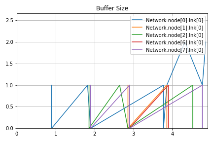
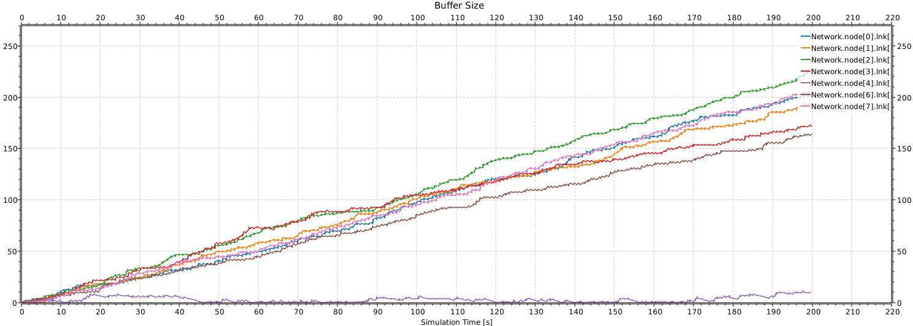

# Laboratorio 4 – Redes y Sistemas Distribuidos

## Informe

**Autores:**

* Aravena Aaron Lihuel
* Ferández Bodereau Constanza
* Fonseca Gonzalo Agustín

---

# Introducción
En este laboratorio trabajaremos con una estructura de red de tipo anillo y realizaremos análisis en distintos casos para ver como se comporta la red, además de, implementar un algoritmo de enrutamiento en la capa de red que redirija el tráfico para evitar congestión y obtener mayor entrega de paquetes.

---

## Caso 1

---

# Análisis de Resultados

---

## Caso 1
***Escenario e hipotésis:** En este caso vemos claramente que ni el nodo 3, ni 4 participan de la red, lo cual nos lleva a la hipotésis de que teniendo en cuenta el algoritmo, puede haber cierta congestión ya que los recursos que si se usen la red, asumirirían toda la carga.

---
### Métricas obtenidas y uso de recursos

En esta primera simulación se configuraron dos fuentes de tráfico: `node[0]` y `node[2]`, ambas transmitiendo hacia `node[5]`. Se evaluaron las métricas recolectadas por los módulos `App` (a través del vector de `Delay`) y `Lnk` (a través del vector de `Buffer Size`).

---

### Métricas recolectadas

Se observaron seis vectores en total:

- 5 vectores de `Buffer Size` correspondientes a los nodos por los que circularon los paquetes (`node[0]`, `node[1]`, `node[2]`, `node[6]`, y `node[7]`).
- 1 vector de `Delay` en `node[5]`, que recibió los paquetes.

---

Con estas métricas podemos analizar el comportamiento de nuestra red.

### Desviación estandar como Métrica de análisis
Esta es una medida de dispersión que nos indica cuan alejados están los datos respecto al promedio y nos ayudara a entender mejor como está funcionando la red.

Si tenemos una desviación estandar alta, es decir, alta variabilidad, entonces nos dice que hay paquetes que llegan muy rápido y otros muy tarde.

Una desviación estandar baja, marca una tendencia a un comportamiento más estable, es decir los paquetes no varian mucho su tiempo de llegada. Esto se da en aquellos nodos con baja congestión.


---
### Uso de recursos

- El buffer de `node[0]` presenta una ocupación promedio muy elevada (Mean ≈ 92.9) con una desviación estándar de ≈ 54.88, lo que indica que en ese nodo se genera una alta acumulación de paquetes y también una variabilidad considerable en dicha acumulación, ya que el `node[0]` no solo produce paquetes sino que también recibe los enviados por el `node[2]`, lo cual satura rápidamente el buffer.
- En cambio, los buffers de `node[1]`, `node[2]`, `node[6]` y `node[7]` muestran valores promedio bajos (≈ 0.5 a 3.3) y desviaciones estándar pequeñas (≈ 0.5 a 2.5), lo cual marca que no están siendo puntos críticos de congestión.
- En cuanto al retardo (`Delay`) registrado por `node[5]`, el valor promedio es de 51.16 segundos con una desviación estándar de 28.38 segundos. Esta desviación estándar nos marca claramente lo que hablamos antes, que exista una diferencia en los tiempos de llegada de los paquetes. Además, el tiempo promedio es muy alto para la llegada un paquete lo que indica una clara congestión en el tráfico.

---

### Gráficos
**Ocupación de Buffers en emisores**
  
En este gráfico, podemos ver la ocupacion de los buffers de nuestros nodos 1,2,6,7 y 0, viendo que 0 es el más ocupado por lo explicado anteriormente.


**Delay en el nodo receptor (5)**
![Delay vs Time en node[5]](images/delay1.png)  
Acá podemos ver cuánto tarda cada paquete en llegar al nodo 5.

---

### ¿Se puede mejorar?

Sí, podría implementarse algoritmos de ruteo más eficientes para distribuir mejor el tráfico en la red.

---

## Caso 2

**Escenario**: Todos los nodos (0,1,2,3,4,6 y 7) envían paquetes de 125 KB al nodo 5 en un anillo con la siguiente configuración:

```
Network.node[{0,1,2,3,4,6,7}].app.interArrivalTime = exponential(1)
Network.node[{0,1,2,3,4,6,7}].app.destination = 5
Network.node[{0,1,2,3,4,6,7}].app.packetByteSize = 125000
```

Comparamos el rendimiento del enrutamiento estático frente a un enrutamiento optimizado.

---

### Métricas

* **Buffers**: Saturación constante en 200 paquetes (velocidad de entrada 1 Mbps contra  salida 0,5 Mbps).
* **Retraso medio**: 102 s (usando `interArrivalTime = exponential(1)`).
* **Saltos**: Hasta 7 saltos en el recorrido completo.

Además, medimos la capacidad de buffers en los nodos, la demora de transmisión al nodo destino (5) y la cantidad de saltos necesarios para cada paquete.

---
### Gráficos
**Ocupación de Buffers en emisores**
  
En este gráfico, cada línea muestra cuántos paquetes hay en la cola justo después de cada nodo emisor (0,1,2,3,4,6,7). Todas suben de forma parecida hasta llegar al máximo de 200 paquetes. Eso significa que los nodos envían datos más rápido de lo que la cola puede procesar, y por eso se llena.


**Delay en el nodo receptor (5)**
![Delay vs Time en node[5]](images/delaycaso2.svg)  
Acá podemos ver cuánto tarda cada paquete en llegar al nodo 5. La línea va subiendo con el tiempo y llega a valores de más de 200 segundos. Eso nos muestra que los paquetes están esperando primero en las colas de los emisores y luego en la del receptor, y por eso el retraso promedio es el doble que en el Caso 1.

---
### Análisis

El problema principal surge porque los paquetes llegan más rápido de lo que pueden ser enviados, generando acumulación en los buffers y retrasando significativamente el tráfico.

Al ajustar el tráfico a `interArrivalTime = exponential(7)` (≈7 s), logramos estabilizar los buffers pero si reducimos a 6,5 s vuelve a haber congestión en el nodo 6.

Con el enrutamiento optimizado:

* El uso de buffers se equilibra, evitando saturación constante.
* Los saltos se reducen de un máximo de 7 a solo 4 (una mejora del 50 %).
* Se logra estabilidad hasta una tasa de envío de 1,4 paquetes por segundo (contra un 0,9 con rutas estáticas).
* El throughput es mayor debido a la eficiencia de las rutas más cortas.

Además, al comparar cuántos paquetes se envían por segundo frente a cuántos llegan efectivamente al destino, vemos que la red con enrutamiento optimizado se mantiene estable en condiciones de tráfico más intensas:

* Rutas estáticas: estabilidad hasta aproximadamente 0,9 paquetes/segundo (`InterArrivalTime > 7,5`).
* Rutas optimizadas: estabilidad hasta aproximadamente 1,4 paquetes/segundo (`InterArrivalTime > 5`).

Cuando el tráfico alcanza aproximadamente 3 paquetes por segundo (`InterArrivalTime ≈ 2,33`), ambas configuraciones llegan a su límite máximo, pero la red optimizada logra procesar efectivamente casi el doble de paquetes gracias a rutas más cortas y eficientes.

---

### Conclusión

Cuando usamos rutas estáticas y enviamos muchos paquetes muy seguido (`exponential(1)`), la red se satura rápidamente y el retraso aumenta considerablemente.

Si ajustamos el tiempo entre envíos (`exponential(7)`) y utilizamos un algoritmo que elige mejores rutas, logramos que la red funcione de forma más estable y rápida.

---
## Diseño de algoritmo de enrutamiento

---
## Objetivo:
Diseñar un algoritmo de enrutamiento en OMNET para una red de topología anillo de 8 nodos que supere al propuesto por la cátedra.

---
## Diseño del algoritmo:
Utilizaremos paquetes "Hello" para descubrir la topología de la red y determinar el camino más corto al destino de los paquetes y así controlar la congestión, utilizando lógica del algoritmo de Dijkstra.

---
## Implementación Progresiva del Envío de Paquetes “Hello” y Descubrimiento de Topología

---
### Paso 1: Definición de mensajes `hPacket` para Hello

**Commit:** `Define hPacket for Hello messages`

Se definió un nuevo tipo de mensaje `hPacket` en el archivo `packet.msg` para el descubrimiento de la topología.

```cpp
packet Packet {
    int source;
    int destination;
    int kind; // 0: data, 2: hello
}

class NodeHop {
    int currentNode;
    int hopCount;
    int way; // 0: RIGHT_DIR, 1: LEFT_DIR
}

packet hPacket extends Packet {
    NodeHop nodeHopLists[];
    int hopTimes;
    int direction;
}
```
Justificación: Los paquetes “Hello” requieren información adicional más
allá de los paquetes de datos estándar para construir la tabla de enrutamiento
(lista de nodos visitados y saltos).

---