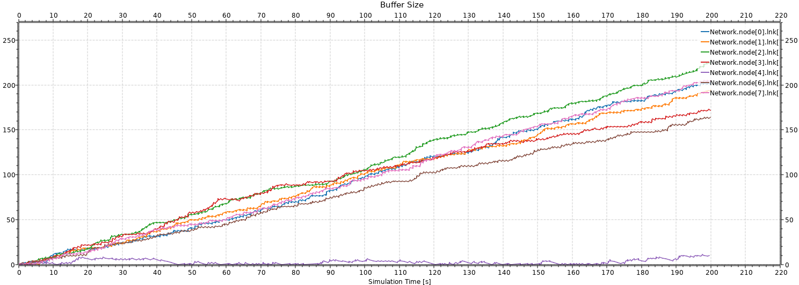
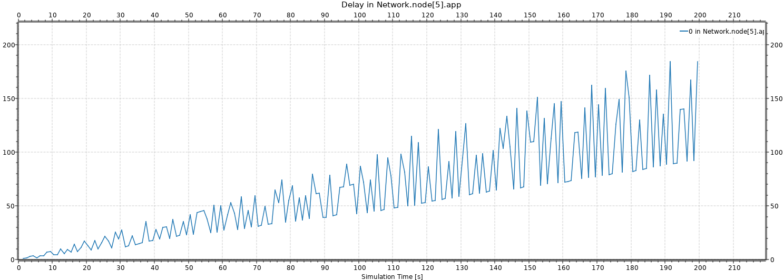

# Laboratorio 4 – Redes y Sistemas Distribuidos

## Informe

**Autores:**

* Aravena Aaron Lihuel
* Ferández Bodereau Constanza
* Fonseca Gonzalo Agustín

---

# Introducción
En este laboratorio trabajaremos con una estructura de red de tipo anillo y realizaremos análisis en distintos casos para ver como se comporta la red, además de, implementar un algoritmo de enrutamiento en la capa de red que redirija el tráfico para evitar congestión y obtener mayor entrega de paquetes.


---

# Análisis de Resultados

---

## Caso 1
**Escenario e hipotésis:** En este caso vemos claramente que ni el nodo 3, ni 4 participan de la red, lo cual nos lleva a la hipotésis de que teniendo en cuenta el algoritmo, puede haber cierta congestión ya que los recursos que si se usen la red, asumirirían toda la carga.

---
### Métricas obtenidas y uso de recursos

En esta primera simulación se configuraron dos fuentes de tráfico: `node[0]` y `node[2]`, ambas transmitiendo hacia `node[5]`. Se evaluaron las métricas recolectadas por los módulos `App` (a través del vector de `Delay`) y `Lnk` (a través del vector de `Buffer Size`).

---

### Métricas recolectadas

Se observaron seis vectores en total:

- 5 vectores de `Buffer Size` correspondientes a los nodos por los que circularon los paquetes (`node[0]`, `node[1]`, `node[2]`, `node[6]`, y `node[7]`).
- 1 vector de `Delay` en `node[5]`, que recibió los paquetes.

---

Con estas métricas podemos analizar el comportamiento de nuestra red.

### Desviación estandar como Métrica de análisis
Esta es una medida de dispersión que nos indica cuan alejados están los datos respecto al promedio y nos ayudara a entender mejor como está funcionando la red.

Si tenemos una desviación estandar alta, es decir, alta variabilidad, entonces nos dice que hay paquetes que llegan muy rápido y otros muy tarde.

Una desviación estandar baja, marca una tendencia a un comportamiento más estable, es decir los paquetes no varian mucho su tiempo de llegada. Esto se da en aquellos nodos con baja congestión.


---
### Uso de recursos

- El buffer de `node[0]` presenta una ocupación promedio muy elevada (Mean ≈ 92.9) con una desviación estándar de ≈ 54.88, lo que indica que en ese nodo se genera una alta acumulación de paquetes y también una variabilidad considerable en dicha acumulación, ya que el `node[0]` no solo produce paquetes sino que también recibe los enviados por el `node[2]`, lo cual satura rápidamente el buffer.
- En cambio, los buffers de `node[1]`, `node[2]`, `node[6]` y `node[7]` muestran valores promedio bajos (≈ 0.5 a 3.3) y desviaciones estándar pequeñas (≈ 0.5 a 2.5), lo cual marca que no están siendo puntos críticos de congestión.
- En cuanto al retardo (`Delay`) registrado por `node[5]`, el valor promedio es de 51.16 segundos con una desviación estándar de 28.38 segundos. Esta desviación estándar nos marca claramente lo que hablamos antes, que exista una diferencia en los tiempos de llegada de los paquetes. Además, el tiempo promedio es muy alto para la llegada un paquete lo que indica una clara congestión en el tráfico.

---

### Gráficos
**Ocupación de Buffers en emisores**
  
En este gráfico, podemos ver la ocupacion de los buffers de nuestros nodos 1,2,6,7 y 0, viendo que 0 es el más ocupado por lo explicado anteriormente.


**Delay en el nodo receptor (5)**
![Delay vs Time en node[5]](images/delay1.png)  
Acá podemos ver cuánto tarda cada paquete en llegar al nodo 5.

---

### ¿Se puede mejorar?

Sí, podría implementarse algoritmos de ruteo más eficientes para distribuir mejor el tráfico en la red.

---

## Caso 2

**Escenario**: Todos los nodos (0,1,2,3,4,6 y 7) envían paquetes de 125 KB al nodo 5 en un anillo con la siguiente configuración:

```
Network.node[{0,1,2,3,4,6,7}].app.interArrivalTime = exponential(1)
Network.node[{0,1,2,3,4,6,7}].app.destination = 5
Network.node[{0,1,2,3,4,6,7}].app.packetByteSize = 125000
```

Comparamos el rendimiento del enrutamiento estático frente a un enrutamiento optimizado.

---

### Métricas

* **Buffers**: Saturación constante en 200 paquetes (velocidad de entrada 1 Mbps contra  salida 0,5 Mbps).
* **Retraso medio**: 102 s (usando `interArrivalTime = exponential(1)`).
* **Saltos**: Hasta 7 saltos en el recorrido completo.

Además, medimos la capacidad de buffers en los nodos, la demora de transmisión al nodo destino (5) y la cantidad de saltos necesarios para cada paquete.

---
### Gráficos
**Ocupación de Buffers en emisores**
  
En este gráfico, cada línea muestra cuántos paquetes hay en la cola justo después de cada nodo emisor (0,1,2,3,4,6,7). Todas suben de forma parecida hasta llegar al máximo de 200 paquetes. Eso significa que los nodos envían datos más rápido de lo que la cola puede procesar, y por eso se llena.


**Delay en el nodo receptor (5)**
![Delay vs Time en node[5]](images/delaycaso2.svg)  
Acá podemos ver cuánto tarda cada paquete en llegar al nodo 5. La línea va subiendo con el tiempo y llega a valores de más de 200 segundos. Eso nos muestra que los paquetes están esperando primero en las colas de los emisores y luego en la del receptor, y por eso el retraso promedio es el doble que en el Caso 1.

---
### Análisis

El problema principal surge porque los paquetes llegan más rápido de lo que pueden ser enviados, generando acumulación en los buffers y retrasando significativamente el tráfico.

Al ajustar el tráfico a `interArrivalTime = exponential(7)` (≈7 s), logramos estabilizar los buffers pero si reducimos a 6,5 s vuelve a haber congestión en el nodo 6.

Con el enrutamiento optimizado:

* El uso de buffers se equilibra, evitando saturación constante.
* Los saltos se reducen de un máximo de 7 a solo 4 (una mejora del 50 %).
* Se logra estabilidad hasta una tasa de envío de 1,4 paquetes por segundo (contra un 0,9 con rutas estáticas).
* El throughput es mayor debido a la eficiencia de las rutas más cortas.

Además, al comparar cuántos paquetes se envían por segundo frente a cuántos llegan efectivamente al destino, vemos que la red con enrutamiento optimizado se mantiene estable en condiciones de tráfico más intensas:

* Rutas estáticas: estabilidad hasta aproximadamente 0,9 paquetes/segundo (`InterArrivalTime > 7,5`).
* Rutas optimizadas: estabilidad hasta aproximadamente 1,4 paquetes/segundo (`InterArrivalTime > 5`).

Cuando el tráfico alcanza aproximadamente 3 paquetes por segundo (`InterArrivalTime ≈ 2,33`), ambas configuraciones llegan a su límite máximo, pero la red optimizada logra procesar efectivamente casi el doble de paquetes gracias a rutas más cortas y eficientes.

---

### Conclusión

Cuando usamos rutas estáticas y enviamos muchos paquetes muy seguido (`exponential(1)`), la red se satura rápidamente y el retraso aumenta considerablemente.

Si ajustamos el tiempo entre envíos (`exponential(7)`) y utilizamos un algoritmo que elige mejores rutas, logramos que la red funcione de forma más estable y rápida.

---
## Diseño de algoritmo de enrutamiento

---
## Objetivo:
Diseñar un algoritmo de enrutamiento en OMNET para una red de topología anillo de 8 nodos que supere al propuesto por la cátedra.

---
## Diseño del algoritmo:
Utilizaremos paquetes "Hello" para descubrir la topología de la red y determinar el camino más corto al destino de los paquetes y así controlar la congestión, utilizando lógica del algoritmo de Dijkstra.

---
## Implementación Progresiva del Envío de Paquetes “Hello” y Descubrimiento de Topología

---
### Paso 1: Definición de mensajes `hPacket` para Hello

**Commit:** `Define hPacket for Hello messages`

Se definió un nuevo tipo de mensaje `hPacket` en el archivo `packet.msg` para el descubrimiento de la topología.

```cpp
packet Packet {
    int source;
    int destination;
    int kind; // 0: data, 2: hello
}

class NodeHop {
    int currentNode;
    int hopCount;
    int way; // 0: RIGHT_DIR, 1: LEFT_DIR
}

packet hPacket extends Packet {
    NodeHop nodeHopLists[];
    int hopTimes;
    int direction;
}
```
**Justificación**:
Los paquetes “Hello” requieren información adicional más allá de los paquetes de datos estándar para construir la tabla de enrutamiento (lista de nodos visitados y saltos).

---

### Paso 2: Inicialización y Envío de Paquetes “Hello” en el Módulo Net  
**Commit:** “Hello-Packet-initialization”

Cada nodo debe iniciar el envío de paquetes “Hello” en ambas direcciones al inicio de la simulación.

**Acción:**  
  En el método `initialize()` del módulo `Net` (`Net.cc`), se crean y envían dos paquetes `hPacket` (uno para cada dirección, `RIGHT_DIR` y `LEFT_DIR`). Estos paquetes se envían a las compuertas `toLnk$o` correspondientes.  

- Código proporcionado que realiza esta acción:

```cpp
// Net::initialize()
void Net::initialize()
{
    NodeRoute node = {this->getParentModule()->getIndex(), 0, RIGHT_DIR};
    routeList.append(node); // Assuming routeList is for the node itself initially

    hPacket *rightHelloPkt = new hPacket();
    rightHelloPkt->setByteLength(par("packetByteSize"));
    rightHelloPkt->setSource(this->getParentModule()->getIndex());
    rightHelloPkt->setDestination(this->getParentModule()->getIndex());
    rightHelloPkt->setHopTimes(0);
    rightHelloPkt->setKind(2); // Kind 2 for Hello packets
    rightHelloPkt->setDirection(RIGHT_DIR);
    send(rightHelloPkt, "toLnk$o", RIGHT_DIR);

    hPacket *leftHelloPkt = new hPacket();
    leftHelloPkt->setByteLength(par("packetByteSize"));
    leftHelloPkt->setSource(this->getParentModule()->getIndex());
    leftHelloPkt->setDestination(this->getParentModule()->getIndex());
    leftHelloPkt->setDirection(LEFT_DIR);
    leftHelloPkt->setHopTimes(0);
    leftHelloPkt->setKind(2); // Kind 2 for Hello packets
    send(leftHelloPkt, "toLnk$o", LEFT_DIR);
}
```
**Justificación**:
Al inicio, cada nodo debe anunciar su presencia y comenzar a descubrir la red. En una red circular, enviar en ambas direcciones permite descubrir la topología completa.

---
## Paso 3: Manejo de Paquetes “Hello” en el Módulo Net  
**Commit:** “Manejo-HelloPacket”  

Cuando un módulo Net recibe un paquete “Hello”, debe procesarlo para actualizar su conocimiento de la red. 

**Acción:** 
En `Net::handleMessage()`, la sección que comprueba `if pkt->getKind() == 2` (es decir, un Hello packet) se encarga de esto. Se necesita un mecanismo para:

1. Identificar si es un paquete “Hello” propio (ya visto). Si lo es, se procesa la información contenida en el paquete y se elimina el paquete.  
2. Si no es propio, incrementar el contador de saltos (`hopTimes`), añadir la información del nodo actual al paquete (`NodeHop`) y reenviar el paquete en la misma dirección. El código proporcionado ya implementa esta lógica:


```cpp
// Net::handleMessage() para paquetes Hello
if (pkt->getKind() == 2) {
    // Caso 1: el paquete Hello ya llegó a su destino (este nodo)
    if (pkt->getDestination() == this->getParentModule()->getIndex()) {
        hPacket *helloPkt = (hPacket *)pkt;
        // Recorre la lista de saltos que trae el Hello packet
        for (int i = 0; i < helloPkt->getNodeHopListsArraySize(); i++) {
            NodeRoute node = {
                helloPkt->getNodeHopLists(i).currentNode,
                helloPkt->getNodeHopLists(i).hopCount
            };
            routeList.replace(node); 
            // Actualiza o añade la ruta según el conteo de saltos
        }
        delete helloPkt;  // Borra el Hello packet
        return;
    }

    // Caso 2: el paquete Hello todavía no llegó a destino, sigue circulando
    hPacket *helloPkt = (hPacket *)pkt;
    // Incrementa el contador de saltos
    helloPkt->setHopTimes(helloPkt->getHopTimes() + 1);

    // Crea un nuevo NodeHop con la info de este nodo
    NodeHop *node = new NodeHop();
    node->currentNode = this->getParentModule()->getIndex();
    node->hopCount    = helloPkt->getHopTimes();
    node->way         = helloPkt->getDirection();

    // Añade esta entrada al final de la lista de saltos del Hello packet
    helloPkt->insertNodeHopLists(helloPkt->getNodeHopListsArraySize(), *node);
    delete node;

    // Reenvía el paquete Hello por la misma dirección
    send(helloPkt, "toLnk$o", helloPkt->getDirection());
    return;
}
```
**Justificación**:
Cada nodo va “aprendiendo” la topología cuando los paquetes “Hello” circulan por el anillo. La estructura routeList en cada nodo (Net.cc) sirve como su tabla de enrutamiento, donde se guardan los nodos alcanzables y la dirección para llegar a ellos con el menor número de saltos.
---
## Paso 4: Definición y Uso de `NodeRouteList` y `NodeRoute`  
**Commit:** “Definicion-routing-table”  

Para almacenar la información de enrutamiento que se va descubriendo con los paquetes “Hello”.

**Acción:** 
Se asume la existencia de `node_route_list.h` y `node_route.h`. Estas clases deberían gestionar la routeList y los elementos NodeRoute individualmente. NodeRouteList debería tener un método replace o similar para actualizar las rutas si se encuentra un camino con menos saltos.

```cpp
     struct NodeRoute {
         int nodeID;    // Índice del nodo destino
         int hopCount;  // Cantidad de saltos para llegar a ese nodo
         int way;       // Dirección (0=horario, 1=antihorario) para alcanzar ese nodo
     };
```
     
- Con esta estructura guardamos, por cada destino, cuántos saltos tomar y en qué sentido.

 ```cpp
     class NodeRouteList {
     private:
         std::vector<NodeRoute> routes;  // Lista de rutas conocidas

     public:
         void append(NodeRoute node)
         void replace(NodeRoute newNode);
         NodeRoute getNodeByID(int id);
         };
 ```
**Justificación**:
La routeList es fundamental para que cada nodo construya su conocimiento local de la topología y pueda tomar decisiones de enrutamiento informadas. El método replace es clave para el “pseudoDijkstra”.
---

## Paso 5: Enrutamiento de Paquetes de Datos en el Módulo `Net` 
Una vez que los paquetes "Hello" han establecido las tablas de enrutamiento, los paquetes de datos pueden ser reenviados hacia su destino.

**Acción:** 
En `Net::handleMessage()`, la sección `else if (pkt->getKind() == 0)` se encarga del manejo de paquetes de datos. El código proporcionado ya realiza esta acción:

    ```cpp
    // Net::handleMessage() for data packets
    else if (pkt->getKind() == 0)
    {
        if (pkt->getDestination() == this->getParentModule()->getIndex())
        {
            send(msg, "toApp$o"); // Packet reached its destination
        }
        else
        {
            int direction;
            NodeRoute node;
            node = routeList.getNodeByID(pkt->getDestination());
            direction = node.way; // Get the direction from the routing table
            send(msg, "toLnk$o", direction); // Forward the packet
        }
    }
    ```

**Justificación**:
Los paquetes de datos son enviados a la dirección que la `routeList` indica como la que tiene el menor número de saltos para alcanzar el destino.
---
## Dijkstra para el Camino Más Corto

El algoritmo implementado para el descubrimiento del camino más corto es una forma simplificada del camino mas corto", más bien, es un protocolo de enrutamiento basado en vector de distancia (o de estado de enlace muy rudimentario).

* **Cómo funciona:**
    1.  Cada nodo genera paquetes "Hello" en ambas direcciones con un contador de saltos (`hopTimes`) inicializado en 0 y una lista vacía de nodos visitados (`NodeHopLists`).
    2.  Cuando un nodo intermedio recibe un paquete "Hello":
        * Incrementa el `hopTimes`.
        * Añade su propio ID y el `hopTimes` actual a la lista `NodeHopLists` del paquete.
        * Reenvía el paquete en la misma dirección.
    3.  Cuando un paquete "Hello" regresa a su nodo de origen (el `destination` del paquete es el `index` del nodo actual):
        * El nodo de origen examina la lista `NodeHopLists` dentro del paquete.
        * Para cada nodo en esa lista, el nodo de origen actualiza su `routeList` local. Si ya tiene una entrada para ese nodo, compara el `hopCount` registrado con el `hopCount` del paquete "Hello" para ese nodo. Si el `hopCount` del paquete "Hello" es menor, reemplaza la entrada existente en `routeList` con la nueva información de ruta y dirección.

* **Ventajas de esta aproximación:** Permite que cada nodo construya una tabla de enrutamiento que mapea los nodos destino a la dirección (izquierda o derecha) que proporciona el camino más corto (en términos de saltos) a ese destino.

* **Limitaciones:** No es un Dijkstra completo porque no considera métricas de costo más allá de los saltos (como el retardo del enlace o el ancho de banda). Tampoco es un algoritmo iterativo de inundación y construcción de árboles de caminos más cortos como Dijkstra tradicional, sino que cada paquete "Hello" construye una ruta mientras viaja, y el receptor actualiza su tabla con la mejor información vista.

### Control de Congestión en una Red Simulada

El control de congestión no está explícitamente implementado en el código proporcionado a nivel de `Net` o `App`. Sin embargo, el módulo `Lnk` (Link) tiene una cola (`buffer`) y un mecanismo de servicio que puede ser utilizado para observar y potencialmente controlar la congestión.

* **Observación de Congestión:**
    * El módulo `Lnk` registra el tamaño de la cola (`bufferSizeVector`). Esta métrica es crucial para observar la congestión. Un aumento constante en el tamaño de la cola o un tamaño de cola consistentemente alto indican congestión en el enlace.
    * `Lnk` también tiene un `endServiceEvent` y un `serviceTime` (`pkt->getDuration()`). Si el `serviceTime` se basa en el tamaño del paquete y la tasa de datos del enlace, un aumento en los tiempos de servicio o la duración de los paquetes en la cola también indicaría congestión.


* **Cómo se puede implementar el control de congestión (futuras mejoras):**
    1.  **Mecanismos de Descarte de Paquetes:** Si la cola del `Lnk` supera un umbral, se podrían descartar paquetes. Esto es una forma de control de congestión proactiva o reactiva simple.
    2.  **Mecanismos de Reducción de Tasa en la Aplicación:** El módulo `App` podría ser notificado sobre la congestión (por ejemplo, por el módulo `Net` o `Lnk` si se propaga la información) y reducir su `interArrivalTime` (o aumentar el tiempo entre envíos de paquetes) para disminuir la tasa de inyección de paquetes. Esto se puede lograr con un mensaje de retroalimentación de la capa de enlace o red a la capa de aplicación.
    3.  **Algoritmos de Control de Congestión:** Para una implementación más avanzada, se podrían integrar algoritmos como:
        * **Control de Flujo Basado en Créditos/Ventanas:** Donde el remitente solo envía un número limitado de paquetes hasta que recibe una confirmación del receptor o un indicativo de que hay espacio en la cola.
        * **Algoritmos de Control de Congestión TCP-like:** Como Slow Start, Congestion Avoidance, Fast Retransmit, etc., que ajustan la tasa de envío dinámicamente en función de la pérdida de paquetes o los retrasos.
        * **ECN (Explicit Congestion Notification):** Donde los nodos intermedios marcan los paquetes para indicar congestión en lugar de descartarlos, permitiendo que los puntos finales ajusten su comportamiento.

    Actualmente, el control de congestión es pasivo, solo se puede observar a través de las estadísticas del buffer.

---

## Comparación de Resultados: Caso 1

En el Caso 1, solo los nodos 0 y 2 le mandan paquetes al nodo 5 en la red en anillo de 8 nodos.

### ¿Qué hace el algoritmo original?

El algoritmo original (el "kickstarter") siempre manda los paquetes por la misma salida, siguiendo el sentido horario del anillo. Entonces, por ejemplo:

- Del nodo 0 al 5: pasa por 1, 2, 3, 4 y llega a 5 (5 saltos).
- Del nodo 2 al 5: pasa por 3, 4 y llega a 5 (3 saltos).

### ¿Y nuestro algoritmo?

Nuestro algoritmo nuevo usa mensajes "HELLO" para aprender por dónde llega a cada vecino, y después elige siempre la ruta más corta hasta el destino.

Pero en este caso, el camino más corto sigue siendo el mismo que el del algoritmo original, porque:

- No hay congestión.
- El tráfico es bajo.
- La mejor opción sigue siendo ir en sentido horario.

### ¿Qué pasó con los resultados?

Cuando corrimos las simulaciones, los resultados nos dieron iguales: la demora, el uso de buffers y la cantidad de saltos no cambiaron entre el algoritmo original y el nuestro.

 *Resumen:*  
En el Caso 1, aunque el algoritmo sea más inteligente, no se nota la diferencia porque la red está tranquila y el camino más corto es igual al de siempre. La verdadera mejora aparece cuando hay más tráfico y más competencia por los caminos, como vamos a ver en el Caso 2.

---

## Comparación de Resultados: Caso 2
En el Caso 2, ahora todos los nodos menos el 5 (o sea, 0, 1, 2, 3, 4, 6 y 7) están mandando paquetes al nodo 5, todos al mismo tiempo y con la misma frecuencia y tamaño de paquetes.

### ¿Qué pasa con el algoritmo original?

Como antes, el algoritmo original manda todo el tráfico por la misma salida (siempre sentido horario). Esto hace que todos los paquetes de todos los nodos se acumulen en los mismos enlaces y buffers, lo que genera un embudo y puede saturar la red.

- Hay más cola en los buffers.
- Aparece más demora para entregar los paquetes.
- Incluso puede haber pérdidas si los buffers se llenan.

### ¿Y nuestro algoritmo nuevo?

Ahora sí, acá se nota la diferencia. Nuestro algoritmo, al conocer los caminos gracias a los mensajes HELLO, puede elegir el camino más corto para cada paquete. Esto hace que:

- Algunos nodos manden por un lado, otros por el otro (usando ambos sentidos del anillo).
- El tráfico se reparte mejor, no se genera tanto embudo.
- La demora y el uso de buffers bajan, porque la carga está más distribuida.
- Todo funciona de forma más eficiente.

### ¿Qué muestran los resultados?

Cuando miramos los gráficos y las métricas, se nota que con nuestro algoritmo:

- La demora promedio de los paquetes es menor.
- Los buffers no se llenan tanto.
- La cantidad de saltos puede ser menor o igual, pero ahora el tráfico está mucho más balanceado.
A continuación se muestran dos gráficos que lo evidencian:
  
  


---
**Conclusión general:**  
El algoritmo mejorado se nota en serio cuando la red tiene mucho tráfico, porque reparte mejor la carga y hace que todo funcione más rápido y con menos congestión. En situaciones simples como el Caso 1, no hay diferencia, pero cuando la red se pone exigente, la mejora es clara.

---

