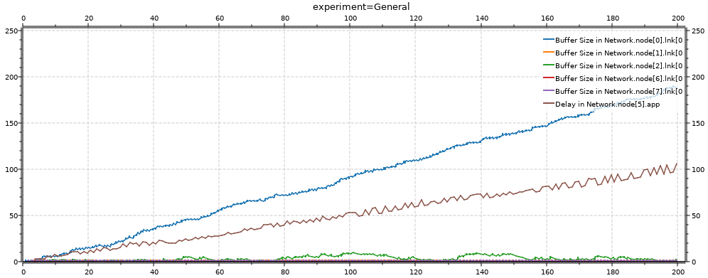

# Laboratorio 4 – Redes y Sistemas Distribuidos

## Informe

**Autores:**

* Aravena Aaron Lihuel
* Ferández Bodereau Constanza
* Fonseca Gonzalo Agustín

---

# Introducción
En este laboratorio trabajaremos con una estructura de red de tipo anillo y realizaremos análisis en distintos casos para ver como se comporta la red, además de, implementar un algoritmo de enrutamiento en la capa de red que redirija el tráfico para evitar congestión y obtener mayor entrega de paquetes.

---

## Caso 1

---
### Métricas
---
### Gráficos
---
### Análisis
---
### Conclusión
---

## Caso 2

**Escenario**: Todos los nodos (0,1,2,3,4,6 y 7) envían paquetes de 125 KB al nodo 5 en un anillo con la siguiente configuración:

```
Network.node[{0,1,2,3,4,6,7}].app.interArrivalTime = exponential(1)
Network.node[{0,1,2,3,4,6,7}].app.destination = 5
Network.node[{0,1,2,3,4,6,7}].app.packetByteSize = 125000
```

Comparamos el rendimiento del enrutamiento estático frente a un enrutamiento optimizado.

---

### Métricas

* **Buffers**: Saturación constante en 200 paquetes (velocidad de entrada 1 Mbps contra  salida 0,5 Mbps).
* **Retraso medio**: 102 s (usando `interArrivalTime = exponential(1)`).
* **Saltos**: Hasta 7 saltos en el recorrido completo.

Además, medimos la capacidad de buffers en los nodos, la demora de transmisión al nodo destino (5) y la cantidad de saltos necesarios para cada paquete.

---
### Gráficos
**Ocupación de Buffers en emisores**
  
En este gráfico, cada línea muestra cuántos paquetes hay en la cola justo después de cada nodo emisor (0,1,2,3,4,6,7). Todas suben de forma parecida hasta llegar al máximo de 200 paquetes. Eso significa que los nodos envían datos más rápido de lo que la cola puede procesar, y por eso se llena.


**Delay en el nodo receptor (5)**
![Delay vs Time en node[5]](./images/delay_caso2.png)  
Acá podemos ver cuánto tarda cada paquete en llegar al nodo 5. La línea va subiendo con el tiempo y llega a valores de más de 200 segundos. Eso nos muestra que los paquetes están esperando primero en las colas de los emisores y luego en la del receptor, y por eso el retraso promedio es el doble que en el Caso 1.

---
### Análisis

El problema principal surge porque los paquetes llegan más rápido de lo que pueden ser enviados, generando acumulación en los buffers y retrasando significativamente el tráfico.

Al ajustar el tráfico a `interArrivalTime = exponential(7)` (≈7 s), logramos estabilizar los buffers pero si reducimos a 6,5 s vuelve a haber congestión en el nodo 6.

Con el enrutamiento optimizado:

* El uso de buffers se equilibra, evitando saturación constante.
* Los saltos se reducen de un máximo de 7 a solo 4 (una mejora del 50 %).
* Se logra estabilidad hasta una tasa de envío de 1,4 paquetes por segundo (contra un 0,9 con rutas estáticas).
* El throughput es mayor debido a la eficiencia de las rutas más cortas.

Además, al comparar cuántos paquetes se envían por segundo frente a cuántos llegan efectivamente al destino, vemos que la red con enrutamiento optimizado se mantiene estable en condiciones de tráfico más intensas:

* Rutas estáticas: estabilidad hasta aproximadamente 0,9 paquetes/segundo (`InterArrivalTime > 7,5`).
* Rutas optimizadas: estabilidad hasta aproximadamente 1,4 paquetes/segundo (`InterArrivalTime > 5`).

Cuando el tráfico alcanza aproximadamente 3 paquetes por segundo (`InterArrivalTime ≈ 2,33`), ambas configuraciones llegan a su límite máximo, pero la red optimizada logra procesar efectivamente casi el doble de paquetes gracias a rutas más cortas y eficientes.

---

### Conclusión

Cuando usamos rutas estáticas y enviamos muchos paquetes muy seguido (`exponential(1)`), la red se satura rápidamente y el retraso aumenta considerablemente.

Si ajustamos el tiempo entre envíos (`exponential(7)`) y utilizamos un algoritmo que elige mejores rutas, logramos que la red funcione de forma más estable y rápida.